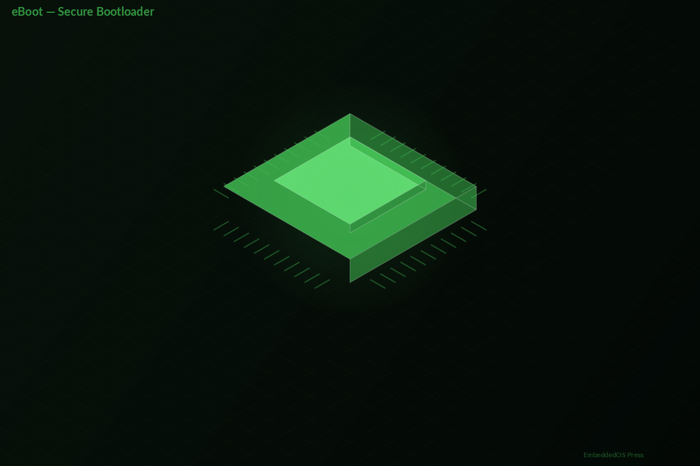
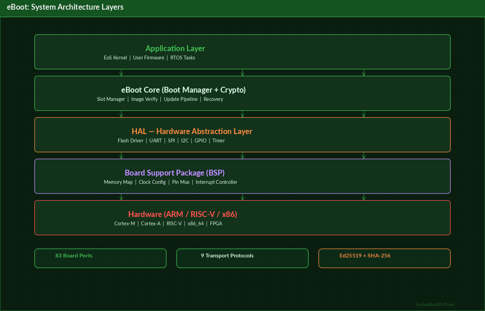
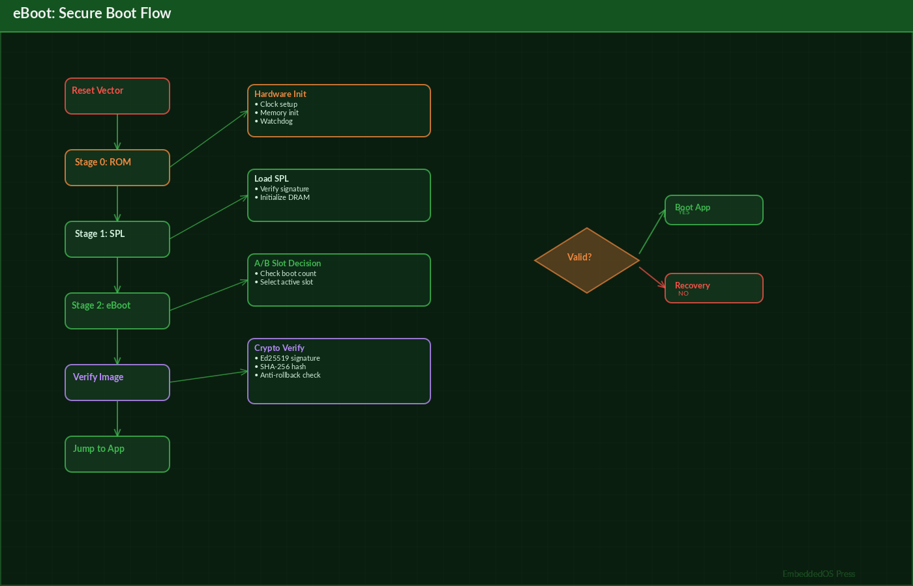
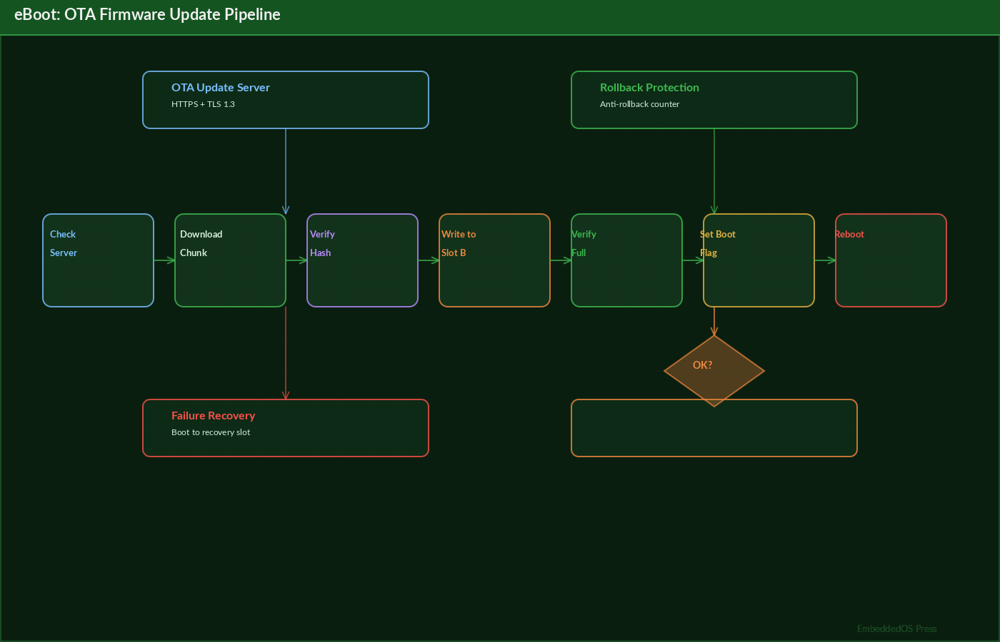
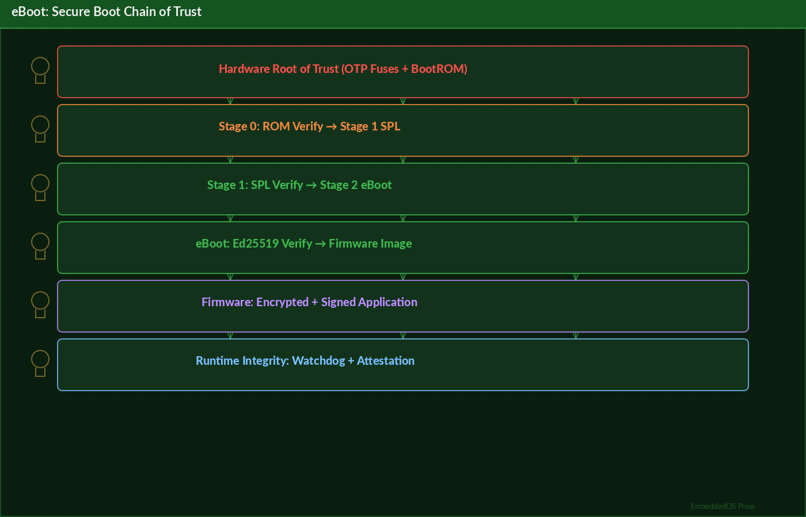
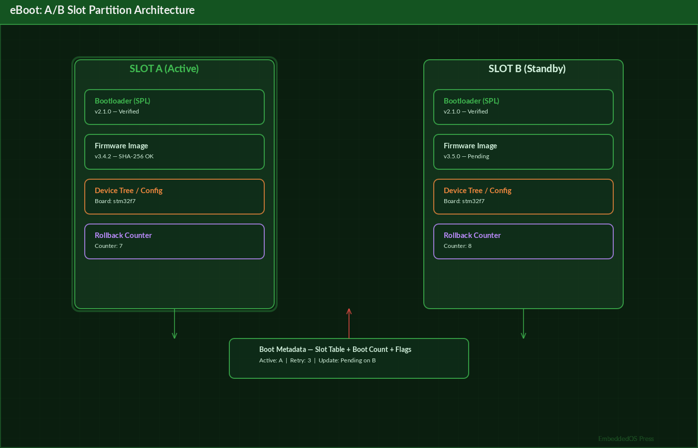

# eBoot: The Definitive Reference Guide

## EmbeddedOS Secure Boot [@uefi2021]loader Platform

**Version 0.1.0**

**Srikanth Patchava & EmbeddedOS Contributors**

**April 2026**

---

*A comprehensive technical reference for the eBoot multi-platform modular bootloader with multicore, secure boot, and firmware update [@suit_manifest] support.*

*Published by the EmbeddedOS Project*
*Copyright (c) 2026 EoS Project. MIT License.*

---

## Preface




eBoot is the production-grade bootloader platform for the EmbeddedOS (EoS) ecosystem. It provides a complete, secure, and modular boot solution for embedded systems — from tiny Cortex-M microcontrollers to multi-core ARM64 and x86_64 edge servers.

This reference guide is intended for firmware engineers, system architects, and embedded developers who need to understand, configure, deploy, and extend eBoot across their hardware platforms. Whether you are bringing up a new board, integrating secure boot into your product pipeline, or building a custom firmware update system, this book provides the authoritative reference you need.

eBoot supports **83 board ports** across **73 architecture families**, with clean separation between boot logic, hardware abstraction, and firmware management. It integrates seamlessly with the EoS operating system and the ebuild build system to provide a complete embedded development workflow.

### Who This Book Is For

- **Firmware Engineers** who need to port eBoot to new hardware or customize boot behavior
- **System Architects** designing secure boot chains and firmware update strategies
- **Embedded Developers** integrating eBoot with EoS, FreeRTOS, Zephyr, or Linux
- **Security Engineers** evaluating and hardening the boot chain
- **DevOps/Release Engineers** building CI/CD pipelines for firmware delivery

### How This Book Is Organized

- **Part I: Foundations** — Architecture, boot flow, and core concepts
- **Part II: Core Services** — Detailed coverage of all 22 boot services
- **Part III: Platform Porting** — Board support, HAL, and bring-up procedures
- **Part IV: Security** — Secure boot, cryptographic verification, and anti-rollback
- **Part V: Firmware Updates** — OTA, transport protocols, and A/B [@android_ab] slot management
- **Part VI: Advanced Topics** — Multicore boot, RTOS integration, UEFI-style services
- **Part VII: Reference** — Complete API reference, configuration schemas, troubleshooting

### Conventions Used in This Book

- `monospace` — Code, commands, file paths, and API names
- **Bold** — Important terms and key concepts
- *Italic* — Emphasis and first use of technical terms
- `>>` — Shell prompt for commands

---

## Table of Contents

- [Part I: Foundations](#part-i-foundations)
  - [Chapter 1: Introduction to eBoot](#chapter-1-introduction-to-eboot)
  - [Chapter 2: Architecture Overview](#chapter-2-architecture-overview)
  - [Chapter 3: Boot Flow — From Reset to Application](#chapter-3-boot-flow--from-reset-to-application)
- [Part II: Core Services](#part-ii-core-services)
  - [Chapter 4: Boot Control and Slot Management](#chapter-4-boot-control-and-slot-management)
  - [Chapter 5: Image Verification and Cryptography](#chapter-5-image-verification-and-cryptography)
  - [Chapter 6: Firmware Update Pipeline](#chapter-6-firmware-update-pipeline)
  - [Chapter 7: Transport Protocols](#chapter-7-transport-protocols)
  - [Chapter 8: Board Configuration System](#chapter-8-board-configuration-system)
- [Part III: Platform Porting](#part-iii-platform-porting)
  - [Chapter 9: HAL and Board Registry](#chapter-9-hal-and-board-registry)
  - [Chapter 10: Supported Platforms Reference](#chapter-10-supported-platforms-reference)
  - [Chapter 11: Porting eBoot to a New Board](#chapter-11-porting-eboot-to-a-new-board)
- [Part IV: Security](#part-iv-security)
  - [Chapter 12: Secure Boot Chain](#chapter-12-secure-boot-chain)
  - [Chapter 13: Cryptographic Services — crypto_boot API](#chapter-13-cryptographic-services--crypto_boot-api)
  - [Chapter 14: Anti-Rollback and Version Protection](#chapter-14-anti-rollback-and-version-protection)
- [Part V: Firmware Updates](#part-v-firmware-updates)
  - [Chapter 15: A/B Slot Architecture](#chapter-15-ab-slot-architecture)
  - [Chapter 16: Stream-Based Update Pipeline](#chapter-16-stream-based-update-pipeline)
  - [Chapter 17: Recovery and Factory Reset](#chapter-17-recovery-and-factory-reset)
- [Part VI: Advanced Topics](#part-vi-advanced-topics)
  - [Chapter 18: Multicore and Multiprocessor Boot](#chapter-18-multicore-and-multiprocessor-boot)
  - [Chapter 19: RTOS-Aware Boot](#chapter-19-rtos-aware-boot)
  - [Chapter 20: UEFI-Style Services](#chapter-20-uefi-style-services)
  - [Chapter 21: Boot Menu and Interactive Shell](#chapter-21-boot-menu-and-interactive-shell)
- [Part VII: Reference](#part-vii-reference)
  - [Chapter 22: Complete API Reference](#chapter-22-complete-api-reference)
  - [Chapter 23: Flash Layout and Memory Maps](#chapter-23-flash-layout-and-memory-maps)
  - [Chapter 24: Configuration Reference](#chapter-24-configuration-reference)
  - [Chapter 25: eFlash — Unified Flashing Tool](#chapter-25-eflash--unified-flashing-tool)
  - [Chapter 26: Building and Testing](#chapter-26-building-and-testing)
  - [Chapter 27: Troubleshooting](#chapter-27-troubleshooting)
- [Appendix A: Glossary](#appendix-a-glossary)
- [Appendix B: Board Compatibility Matrix](#appendix-b-board-compatibility-matrix)
- [Appendix C: Related Projects](#appendix-c-related-projects)

---

# Part I: Foundations

---

## Chapter 1: Introduction to eBoot

### 1.1 What Is eBoot?




eBoot is a multi-platform modular bootloader designed for the EmbeddedOS ecosystem. It provides a complete boot solution that handles everything from initial hardware setup at power-on to loading and verifying the application firmware. Unlike monolithic bootloaders, eBoot uses a staged architecture with clean separation between:

- **Stage-0**: Minimal first-stage bootloader — runs from ROM/flash, initializes essential hardware (clocks, memory controller, UART), and loads Stage-1
- **Stage-1**: Full boot manager — handles firmware verification, A/B slot selection, firmware update, secure boot policy enforcement, and application handoff

This separation allows Stage-0 to remain small and simple (typically 8-16 KB), minimizing the attack surface for the most privileged code in the system.

### 1.2 Key Features

| Category | Features |
|---|---|
| **Boot Management** | Staged boot (stage-0 + stage-1), A/B slots with automatic rollback, boot policy engine |
| **Secure Boot** | Self-contained SHA-256 [@fips180], CRC-32, Ed25519 [@bernstein2012] signature stubs, anti-rollback |
| **Firmware Update** | Stream-based pipeline (256B chunks), XMODEM/YMODEM/raw transports, pluggable custom transports |
| **Multicore** | SMP, AMP, lockstep boot; ARM PSCI, RISC-V SBI HSM, x86 SIPI, mailbox support |
| **Hardware Config** | Declarative pin muxing, memory regions, interrupt priorities, clock trees via macros |
| **RTOS Boot** | Auto-detect FreeRTOS/Zephyr/NuttX, MPU config, structured boot parameter handoff |
| **UEFI-like** | Device table, runtime services (variables, reset, time), interactive boot menu |
| **Board Registry** | Runtime multi-board selection, GCC constructor auto-registration |
| **Recovery** | UART-based recovery protocol, hardware pin trigger, factory reset |
| **Flashing** | Unified eFlash tool wrapping 25 board-vendor tools behind a single CLI |
| **Platforms** | ARM Cortex-M/A, RISC-V 32/64, Xtensa, x86_64, PowerPC, SPARC, SuperH, M68K — 83 board ports |

### 1.3 Design Philosophy

eBoot follows several core design principles:

1. **Platform Agnostic Core**: All boot logic is written in portable C with no platform-specific code. Platform differences are abstracted through the HAL vtable.

2. **Zero Dynamic Allocation**: eBoot never calls `malloc()`. All data structures use static allocation with compile-time sizing, ensuring deterministic memory usage.

3. **Self-Contained Cryptography**: eBoot includes its own SHA-256, CRC-32, and Ed25519 implementations with no external dependencies. This eliminates supply chain risks in the most security-critical code.

4. **Fail-Safe by Default**: Every boot attempt is tracked. If firmware fails to boot after a configurable number of attempts, eBoot automatically rolls back to the last known-good slot.

5. **Minimal Stage-0**: The first-stage bootloader is deliberately kept minimal to reduce the trusted computing base (TCB).

### 1.4 Quick Start

```bash
# Clone the repository
git clone https://github.com/embeddedos-org/eboot.git
cd eboot

# Build for native host (for testing)
cmake -B build -DEBLDR_BUILD_TESTS=ON
cmake --build build
cd build && ctest

# Cross-compile for STM32F4
cmake -B build-arm -DEBLDR_BOARD=stm32f4 \
  -DCMAKE_TOOLCHAIN_FILE=toolchains/arm-none-eabi.cmake
cmake --build build-arm

# Flash to target hardware
python tools/eflash.py flash --board stm32f4 \
  --image build-arm/eboot_firmware.bin --verify --reset
```

### 1.5 Integration with the EoS Ecosystem

eBoot is one component in a larger ecosystem:

```
┌─────────────────────────────────────────────┐
│              EoS Ecosystem                   │
│                                              │
│  ebuild ──→ eBoot ──→ EoS ──→ eApps        │
│  (build)    (boot)    (OS)    (apps)        │
│                                              │
│  eIPC (communication)  eAI (inference)      │
│  eNI (neural input)    EoSim (simulation)   │
└─────────────────────────────────────────────┘
```

When used with **ebuild**, configuration files (flash layout, linker scripts, signing scripts) are auto-generated from hardware schematics. When used standalone, these files can be written manually.

---

## Chapter 2: Architecture Overview

### 2.1 System Architecture




```
┌─────────────────────────────────────────────────────────┐
│                    Boot Flow                             │
│  ROM → Stage-0 → Stage-1 → App (Linux / RTOS)           │
├─────────────────────────────────────────────────────────┤
│              Core Libraries (platform-agnostic)          │
│  ┌─────────┐ ┌──────────┐ ┌──────────┐ ┌────────────┐  │
│  │ Boot    │ │ Firmware │ │ Multicore│ │ Board      │  │
│  │ Control │ │ Update   │ │ Boot     │ │ Config     │  │
│  │ & Slots │ │ Pipeline │ │ SMP/AMP  │ │ Pins/Mem   │  │
│  └────┬────┘ └────┬─────┘ └────┬─────┘ └──────┬─────┘  │
│       │           │            │               │         │
│  ┌────┴───┐  ┌────┴────┐ ┌────┴─────┐  ┌─────┴──────┐  │
│  │ Crypto │  │Transport│ │ RTOS     │  │ Device     │  │
│  │ SHA-256│  │ XMODEM  │ │ Detect & │  │ Table &    │  │
│  │ CRC-32 │  │ YMODEM  │ │ Boot     │  │ Runtime Svc│  │
│  └────────┘  └─────────┘ └──────────┘  └────────────┘  │
├─────────────────────────────────────────────────────────┤
│              HAL + Board Registry                        │
│  eos_board_ops_t vtable → dispatches to active board     │
├──────┬───────┬───────┬───────┬───────┬───────┬──────────┤
│ STM32│ nRF52 │ RPi4  │ i.MX8 │RISC-V │ ESP32 │ x86_64  │
│  F4  │       │       │   M   │  virt │       │  EFI    │
│  H7  │ SAMD51│       │ AM64x │SiFive │       │         │
└──────┴───────┴───────┴───────┴───────┴───────┴──────────┘
```

### 2.2 Repository Structure

```
eboot/
├── include/                  # Public headers (22 APIs)
│   ├── eos_bootctl.h         # Boot control (A/B slots)
│   ├── eos_image.h           # Image verification
│   ├── eos_crypto_boot.h     # Cryptographic primitives
│   ├── eos_fw_update.h       # Firmware update pipeline
│   ├── eos_fw_transport.h    # Transport protocols
│   ├── eos_fwsvc.h           # Firmware services API
│   ├── eos_multicore.h       # Multicore boot
│   ├── eos_rtos_boot.h       # RTOS-aware boot
│   ├── eos_boot_menu.h       # Interactive boot menu
│   ├── eos_device_table.h    # Device table (UEFI-style)
│   ├── eos_runtime_svc.h     # Runtime services
│   ├── eos_board_config.h    # Board configuration macros
│   ├── eos_board_registry.h  # Board registry
│   ├── eos_dram.h            # DDR/DRAM init & training
│   ├── eos_pci.h             # PCI/PCIe enumeration
│   ├── eos_storage.h         # Unified storage
│   ├── eos_power.h           # Power management
│   ├── eos_clock.h           # Clock tree init
│   └── eos_mpu_boot.h       # MPU configuration
├── core/                     # Core logic (platform-agnostic C)
│   ├── bootctl.c             # Boot control block management
│   ├── boot_policy.c         # Boot policy engine
│   ├── slot_manager.c        # Slot selection logic
│   ├── crypto_boot.c         # SHA-256, CRC-32, Ed25519
│   ├── image.c               # Image header parsing
│   ├── fw_update.c           # Firmware update state machine
│   ├── fw_transport.c        # Transport abstraction
│   ├── multicore.c           # Multi-core boot logic
│   ├── rtos_boot.c           # RTOS detection & handoff
│   ├── device_table.c        # Device table management
│   ├── runtime_svc.c         # Runtime services
│   └── recovery.c            # Recovery mode
├── hal/                      # HAL dispatch + board registry
│   ├── hal_dispatch.c        # vtable dispatcher
│   └── board_registry.c      # Board auto-registration
├── stage0/                   # Minimal first-stage bootloader
│   └── stage0_main.c         # Stage-0 entry point
├── stage1/                   # Stage-1 boot manager
│   └── stage1_main.c         # Stage-1 entry point
├── boards/                   # Board ports (83 platforms)
│   ├── stm32f4/              # ARM Cortex-M4 (reference)
│   ├── stm32h7/              # ARM Cortex-M7
│   ├── nrf52/                # ARM Cortex-M4F (BLE)
│   ├── rpi4/                 # ARM64 Cortex-A72
│   ├── imx8m/                # ARM64 Cortex-A53 (NXP)
│   ├── riscv64_virt/         # RISC-V 64 (QEMU)
│   ├── esp32/                # Xtensa LX6 (Espressif)
│   ├── x86_64_efi/           # x86_64 UEFI
│   └── ...                   # + 75 more
├── tests/                    # Unit tests (native host)
├── tools/                    # Host tools (eFlash, imgpack, signing)
├── toolchains/               # CMake toolchain files
├── configs/                  # Boot + flash config schemas (YAML)
└── docs/                     # Documentation
```

### 2.3 Layer Responsibilities

| Layer | Responsibility | Dependencies |
|---|---|---|
| **Stage-0** | Clock init, DRAM init, UART init, load Stage-1 | HAL only |
| **Stage-1** | Slot selection, image verification, policy enforcement, app handoff | Core + HAL |
| **Core** | Boot logic, crypto, update pipeline, device table | None (portable C) |
| **HAL** | Hardware abstraction vtable dispatch | Board drivers |
| **Board Drivers** | Platform-specific hardware init | Vendor SDK/registers |

### 2.4 Data Flow

```
Power-On / Reset
       │
       ▼
┌──────────────┐
│   Stage-0    │  Fixed at flash base (e.g., 0x08000000)
│  (8-16 KB)   │  - Minimal clock init
│              │  - DRAM controller init (if needed)
│              │  - UART init for debug output
│              │  - Load Stage-1 from flash
└──────┬───────┘
       │
       ▼
┌──────────────┐
│   Stage-1    │  Loaded by Stage-0
│  (32-64 KB)  │  - Full boot manager
│              │  - Read boot control block
│              │  - Apply boot policy
│              │  - Select active slot (A or B)
│              │  - Verify image (SHA-256 / Ed25519)
│              │  - Check anti-rollback counter
│              │  - Configure MPU regions
│              │  - Detect RTOS type
│              │  - Handoff to application
└──────┬───────┘
       │
       ▼
┌──────────────┐
│ Application  │  EoS kernel, Linux, FreeRTOS, Zephyr, NuttX
│              │  - Receives boot parameters via structured handoff
│              │  - Can access runtime services
└──────────────┘
```

---

## Chapter 3: Boot Flow — From Reset to Application

### 3.1 Complete Boot Sequence

The eBoot boot sequence follows a deterministic path from hardware reset to application execution:

1. **Hardware Reset** — CPU begins executing from the reset vector (typically flash base address)
2. **Stage-0 Init** — Minimal hardware initialization
   - Configure system clock to operational frequency
   - Initialize DRAM controller and perform memory training (if applicable)
   - Initialize debug UART for boot messages
   - Validate Stage-1 integrity (CRC-32 quick check)
   - Jump to Stage-1 entry point
3. **Stage-1 Boot Manager** — Full boot decision logic
   - Read the Boot Control Block (BCB) from persistent storage
   - Evaluate boot policy rules
   - Select the active firmware slot (A or B)
   - Verify firmware image integrity (SHA-256 hash)
   - Optionally verify firmware signature (Ed25519)
   - Check anti-rollback version counter
   - Configure MPU/MMU for application
   - Detect RTOS type (FreeRTOS, Zephyr, NuttX, Linux, bare-metal)
   - Prepare boot parameters structure
   - Disable interrupts and jump to application entry point
4. **Application Start** — Firmware begins execution with boot context

### 3.2 Boot Control Block (BCB)

The Boot Control Block is a persistent data structure stored in flash/EEPROM that tracks boot state across resets:

```c
typedef struct {
    uint32_t magic;              // EOS_BCB_MAGIC (0x45425442)
    uint32_t version;            // BCB structure version
    uint8_t  active_slot;        // Currently active slot (0=A, 1=B)
    uint8_t  boot_attempts;      // Current consecutive boot attempt count
    uint8_t  max_attempts;       // Maximum attempts before rollback
    uint8_t  upgrade_pending;    // Flag: upgrade test pending
    uint32_t slot_a_version;     // Firmware version in slot A
    uint32_t slot_b_version;     // Firmware version in slot B
    uint8_t  slot_a_valid;       // Slot A validity flag
    uint8_t  slot_b_valid;       // Slot B validity flag
    uint8_t  rollback_count;     // Number of rollbacks performed
    uint8_t  reserved;           // Alignment padding
    uint32_t crc32;              // CRC-32 of this structure
} eos_boot_control_t;
```

### 3.3 Boot Policy Engine

The boot policy engine evaluates a set of rules to determine boot behavior:

```c
// Boot policy evaluation order:
// 1. Check for recovery mode trigger (hardware pin / UART command)
// 2. Check for firmware update pending flag
// 3. Check boot attempt counter against maximum
// 4. Verify active slot image integrity
// 5. If verification fails, try alternate slot
// 6. If both slots fail, enter recovery mode

typedef enum {
    EOS_BOOT_POLICY_NORMAL,       // Boot from active slot
    EOS_BOOT_POLICY_UPGRADE_TEST, // Boot upgraded slot once (test)
    EOS_BOOT_POLICY_ROLLBACK,     // Rollback to previous slot
    EOS_BOOT_POLICY_RECOVERY,     // Enter recovery mode
    EOS_BOOT_POLICY_FACTORY       // Factory reset
} eos_boot_policy_t;
```

### 3.4 Slot Selection Algorithm

```
┌─────────────────────────┐
│   Read Boot Control     │
│   Block from flash      │
└───────────┬─────────────┘
            │
            ▼
┌─────────────────────────┐     Yes    ┌──────────────┐
│  Recovery pin asserted? │───────────▶│ Recovery Mode│
└───────────┬─────────────┘            └──────────────┘
            │ No
            ▼
┌─────────────────────────┐     Yes    ┌──────────────┐
│  Upgrade test pending?  │───────────▶│ Boot Slot B  │
│                         │            │ (one-shot)   │
└───────────┬─────────────┘            └──────────────┘
            │ No
            ▼
┌─────────────────────────┐     Yes    ┌──────────────┐
│  Boot attempts > max?   │───────────▶│ Rollback to  │
│                         │            │ alternate    │
└───────────┬─────────────┘            └──────────────┘
            │ No
            ▼
┌─────────────────────────┐
│  Verify active slot     │
│  (SHA-256 + optional    │
│   Ed25519 signature)    │
└───────────┬─────────────┘
            │
       ┌────┴────┐
       │ Valid?   │
       └────┬────┘
       Yes  │  No
       │    │
       ▼    ▼
  ┌────────┐ ┌──────────────┐
  │ Boot   │ │ Try alternate│
  │ active │ │ slot         │
  │ slot   │ └──────┬───────┘
  └────────┘        │
                ┌───┴───┐
                │Valid?  │
                └───┬───┘
               Yes  │  No
               │    │
               ▼    ▼
          ┌────────┐ ┌──────────┐
          │ Boot   │ │ Recovery │
          │ alt    │ │ mode     │
          └────────┘ └──────────┘
```

---

# Part II: Core Services

---

## Chapter 4: Boot Control and Slot Management

### 4.1 Boot Control API — `eos_bootctl.h`

The boot control module manages the persistent boot state and provides the primary interface for slot management.

#### Core Functions

| Function | Signature | Description |
|---|---|---|
| `eos_bootctl_init` | `int eos_bootctl_init(eos_boot_control_t *ctrl)` | Initialize boot control from persistent storage |
| `eos_bootctl_save` | `int eos_bootctl_save(const eos_boot_control_t *ctrl)` | Save boot control block to persistent storage |
| `eos_bootctl_get_active` | `uint8_t eos_bootctl_get_active(const eos_boot_control_t *ctrl)` | Get currently active slot (0=A, 1=B) |
| `eos_bootctl_set_active` | `int eos_bootctl_set_active(eos_boot_control_t *ctrl, uint8_t slot)` | Set the active slot for next boot |
| `eos_bootctl_mark_valid` | `int eos_bootctl_mark_valid(eos_boot_control_t *ctrl, uint8_t slot)` | Mark a slot as containing valid firmware |
| `eos_bootctl_mark_invalid` | `int eos_bootctl_mark_invalid(eos_boot_control_t *ctrl, uint8_t slot)` | Mark a slot as invalid |
| `eos_bootctl_increment_attempts` | `int eos_bootctl_increment_attempts(eos_boot_control_t *ctrl)` | Increment boot attempt counter |
| `eos_bootctl_reset_attempts` | `int eos_bootctl_reset_attempts(eos_boot_control_t *ctrl)` | Reset boot attempt counter to zero |
| `eos_bootctl_get_version` | `uint32_t eos_bootctl_get_version(const eos_boot_control_t *ctrl, uint8_t slot)` | Get firmware version for a slot |
| `eos_bootctl_validate_crc` | `bool eos_bootctl_validate_crc(const eos_boot_control_t *ctrl)` | Validate BCB CRC-32 integrity |

#### Usage Example

```c
#include "eos_bootctl.h"

void boot_manager(void) {
    eos_boot_control_t ctrl;

    // Load boot control from flash
    if (eos_bootctl_init(&ctrl) != EOS_OK) {
        // First boot or corrupted BCB — initialize defaults
        ctrl.active_slot = EOS_SLOT_A;
        ctrl.max_attempts = 3;
        ctrl.boot_attempts = 0;
        eos_bootctl_save(&ctrl);
    }

    // Check boot attempt limit
    if (ctrl.boot_attempts >= ctrl.max_attempts) {
        // Too many failed boots — rollback
        uint8_t alt = (ctrl.active_slot == EOS_SLOT_A) ? EOS_SLOT_B : EOS_SLOT_A;
        eos_bootctl_set_active(&ctrl, alt);
        eos_bootctl_reset_attempts(&ctrl);
        eos_bootctl_save(&ctrl);
    }

    // Increment attempt counter before booting
    eos_bootctl_increment_attempts(&ctrl);
    eos_bootctl_save(&ctrl);

    // Boot the active slot
    uint8_t slot = eos_bootctl_get_active(&ctrl);
    boot_firmware(slot);
}
```

### 4.2 Slot Manager — `slot_manager.c`

The slot manager implements the high-level slot selection logic, integrating boot control state with image verification and policy evaluation.

```c
// Slot states
typedef enum {
    EOS_SLOT_STATE_EMPTY,      // No firmware installed
    EOS_SLOT_STATE_VALID,      // Verified firmware present
    EOS_SLOT_STATE_INVALID,    // Firmware failed verification
    EOS_SLOT_STATE_TESTING,    // Upgrade test in progress
    EOS_SLOT_STATE_ROLLBACK    // Rolled back from this slot
} eos_slot_state_t;

// Select the best slot to boot
int eos_slot_select(eos_boot_control_t *ctrl, uint8_t *selected_slot);

// Confirm successful boot (called by application after startup)
int eos_slot_confirm_boot(eos_boot_control_t *ctrl);
```

---

## Chapter 5: Image Verification and Cryptography

### 5.1 Image Header Format

Every firmware image managed by eBoot begins with a standardized header:

```c
typedef struct {
    uint32_t magic;           // EOS_IMAGE_MAGIC (0x454F5349)
    uint32_t header_size;     // Size of this header in bytes
    uint32_t image_size;      // Size of firmware payload
    uint32_t version;         // Firmware version (semantic)
    uint32_t build_timestamp; // Unix timestamp of build
    uint8_t  hash[32];        // SHA-256 hash of payload
    uint8_t  signature[64];   // Ed25519 signature (optional)
    uint32_t flags;           // Image flags
    uint32_t header_crc;      // CRC-32 of header fields
} eos_image_header_t;
```

### 5.2 Image Verification API — `eos_image.h`

| Function | Description |
|---|---|
| `eos_image_validate_header` | Validate header magic, size, and CRC |
| `eos_image_verify_hash` | Compute SHA-256 of payload and compare to header hash |
| `eos_image_verify_signature` | Verify Ed25519 signature against embedded public key |
| `eos_image_get_version` | Extract version from image header |
| `eos_image_get_size` | Get total image size (header + payload) |

### 5.3 Cryptographic Services — `eos_crypto_boot.h`

eBoot includes self-contained cryptographic implementations with zero external dependencies:

#### SHA-256

```c
// Streaming SHA-256 API
typedef struct {
    uint32_t state[8];
    uint64_t count;
    uint8_t  buffer[64];
} eos_sha256_ctx_t;

void eos_sha256_init(eos_sha256_ctx_t *ctx);
void eos_sha256_update(eos_sha256_ctx_t *ctx, const uint8_t *data, size_t len);
void eos_sha256_final(eos_sha256_ctx_t *ctx, uint8_t hash[32]);

// One-shot convenience
void eos_sha256(const uint8_t *data, size_t len, uint8_t hash[32]);
```

#### CRC-32

```c
// CRC-32 (ISO 3309 / ITU-T V.42)
uint32_t eos_crc32(const uint8_t *data, size_t len);
uint32_t eos_crc32_update(uint32_t crc, const uint8_t *data, size_t len);
```

#### Ed25519 Signature Verification

```c
// Ed25519 signature verification (verify-only, no signing)
typedef struct {
    uint8_t public_key[32];
} eos_ed25519_ctx_t;

int eos_ed25519_init(eos_ed25519_ctx_t *ctx, const uint8_t public_key[32]);
int eos_ed25519_verify(const eos_ed25519_ctx_t *ctx,
                        const uint8_t *message, size_t msg_len,
                        const uint8_t signature[64]);
```

> **Note**: The Ed25519 implementation in eBoot is a verification stub. For production deployments requiring real cryptographic signature verification, integrate with a certified crypto library or hardware security module. See the security hardening guide in Chapter 12.

### 5.4 Verification Flow

```
┌─────────────────────┐
│  Read Image Header  │
│  from flash         │
└─────────┬───────────┘
          │
          ▼
┌─────────────────────┐     Fail     ┌──────────────┐
│  Validate header    │─────────────▶│ Reject image │
│  (magic + CRC-32)   │              └──────────────┘
└─────────┬───────────┘
          │ Pass
          ▼
┌─────────────────────┐     Fail     ┌──────────────┐
│  Compute SHA-256    │─────────────▶│ Reject image │
│  of payload         │              └──────────────┘
│  Compare to header  │
└─────────┬───────────┘
          │ Pass
          ▼
┌─────────────────────┐     Fail     ┌──────────────┐
│  Verify Ed25519     │─────────────▶│ Reject image │
│  signature          │              └──────────────┘
│  (if policy requires│
│   signatures)       │
└─────────┬───────────┘
          │ Pass
          ▼
┌─────────────────────┐     Fail     ┌──────────────┐
│  Check anti-rollback│─────────────▶│ Reject image │
│  version counter    │              └──────────────┘
└─────────┬───────────┘
          │ Pass
          ▼
    ┌─────────────┐
    │ Image Valid  │
    └─────────────┘
```

---

## Chapter 6: Firmware Update Pipeline

### 6.1 Stream-Based Architecture




eBoot uses a stream-based firmware update pipeline that processes data in 256-byte chunks. The firmware image is never fully loaded into RAM — chunks are written directly to the target flash slot as they arrive.

```c
#include "eos_fw_update.h"

// Start a firmware update to slot B
eos_fw_update_ctx_t ctx;
eos_fw_update_begin(&ctx, EOS_SLOT_B);

// Stream data in chunks
while (data_available()) {
    uint8_t chunk[256];
    size_t len = read_chunk(chunk, sizeof(chunk));
    eos_fw_update_write(&ctx, chunk, len);
}

// Finalize: verify hash, mark slot, set upgrade flag
eos_fw_update_finalize(&ctx, EOS_UPGRADE_TEST);
```

### 6.2 Firmware Update API — `eos_fw_update.h`

| Function | Signature | Description |
|---|---|---|
| `eos_fw_update_begin` | `int eos_fw_update_begin(eos_fw_update_ctx_t *ctx, uint8_t target_slot)` | Initialize update context and erase target slot |
| `eos_fw_update_write` | `int eos_fw_update_write(eos_fw_update_ctx_t *ctx, const uint8_t *data, size_t len)` | Write a chunk to the target slot |
| `eos_fw_update_finalize` | `int eos_fw_update_finalize(eos_fw_update_ctx_t *ctx, eos_upgrade_mode_t mode)` | Verify and commit the update |
| `eos_fw_update_abort` | `int eos_fw_update_abort(eos_fw_update_ctx_t *ctx)` | Cancel an in-progress update |
| `eos_fw_update_progress` | `uint32_t eos_fw_update_progress(const eos_fw_update_ctx_t *ctx)` | Get update progress (0-100%) |

### 6.3 Upgrade Modes

| Mode | Behavior |
|---|---|
| `EOS_UPGRADE_TEST` | Boot new firmware once; if it fails to call `eos_slot_confirm_boot()`, rollback on next reset |
| `EOS_UPGRADE_COMMIT` | Immediately commit new firmware as active; no automatic rollback |
| `EOS_UPGRADE_FACTORY` | Replace factory image (irreversible) |

### 6.4 Update State Machine

```
IDLE ──▶ ERASING ──▶ RECEIVING ──▶ VERIFYING ──▶ COMMITTING ──▶ DONE
  │                      │              │              │
  │                      ▼              ▼              ▼
  └──────────────────── ABORTED ◀── FAILED ◀────── FAILED
```

---

## Chapter 7: Transport Protocols

### 7.1 Firmware Transport API — `eos_fw_transport.h`

eBoot supports pluggable transport protocols for receiving firmware updates:

```c
typedef struct {
    const char *name;
    int (*init)(void *config);
    int (*receive)(uint8_t *buf, size_t max_len, size_t *actual_len);
    int (*send)(const uint8_t *buf, size_t len);
    int (*close)(void);
} eos_fw_transport_t;
```

### 7.2 Built-in Transports

| Transport | Protocol | Use Case |
|---|---|---|
| **XMODEM** | 128-byte blocks, checksum/CRC | Serial console update |
| **YMODEM** | 1024-byte blocks, batch transfer | Serial console (faster) |
| **Raw** | Direct binary stream | Programmatic update via UART/USB |
| **Custom** | User-defined | Network, CAN bus, SPI, etc. |

### 7.3 XMODEM Example

```c
#include "eos_fw_transport.h"
#include "eos_fw_update.h"

void firmware_update_via_xmodem(void) {
    // Initialize XMODEM transport on UART
    eos_fw_transport_t *xmodem = eos_fw_transport_xmodem();
    xmodem->init(NULL);

    // Start update
    eos_fw_update_ctx_t ctx;
    eos_fw_update_begin(&ctx, EOS_SLOT_B);

    uint8_t buf[256];
    size_t len;
    while (xmodem->receive(buf, sizeof(buf), &len) == EOS_OK) {
        eos_fw_update_write(&ctx, buf, len);
    }

    eos_fw_update_finalize(&ctx, EOS_UPGRADE_TEST);
    xmodem->close();
}
```

### 7.4 Registering a Custom Transport

```c
static int my_transport_init(void *config) { /* ... */ return EOS_OK; }
static int my_transport_recv(uint8_t *buf, size_t max, size_t *actual) { /* ... */ return EOS_OK; }
static int my_transport_send(const uint8_t *buf, size_t len) { /* ... */ return EOS_OK; }
static int my_transport_close(void) { /* ... */ return EOS_OK; }

static const eos_fw_transport_t my_transport = {
    .name    = "my_transport",
    .init    = my_transport_init,
    .receive = my_transport_recv,
    .send    = my_transport_send,
    .close   = my_transport_close,
};

// Register during boot
eos_fw_transport_register(&my_transport);
```

---

## Chapter 8: Board Configuration System

### 8.1 Declarative Configuration — `eos_board_config.h`

eBoot provides a macro-based system for declaring board-specific hardware configuration:

```c
#include "eos_board_config.h"

// Pin configuration
EOS_PIN_CONFIG(my_board_pins) = {
    EOS_PIN_DEF("UART_TX",  PORTA, 9,  EOS_PIN_AF_UART, EOS_PIN_PUSH_PULL),
    EOS_PIN_DEF("UART_RX",  PORTA, 10, EOS_PIN_AF_UART, EOS_PIN_INPUT),
    EOS_PIN_DEF("LED",      PORTB, 0,  EOS_PIN_GPIO,    EOS_PIN_PUSH_PULL),
    EOS_PIN_DEF("SPI_CLK",  PORTB, 13, EOS_PIN_AF_SPI,  EOS_PIN_PUSH_PULL),
    EOS_PIN_DEF("SPI_MOSI", PORTB, 15, EOS_PIN_AF_SPI,  EOS_PIN_PUSH_PULL),
    EOS_PIN_DEF("SPI_MISO", PORTB, 14, EOS_PIN_AF_SPI,  EOS_PIN_INPUT),
};

// Memory region configuration
EOS_MEMORY_CONFIG(my_board_mem) = {
    EOS_MEM_REGION("FLASH",  0x08000000, 1024*1024, EOS_MEM_RX),
    EOS_MEM_REGION("SRAM",   0x20000000, 192*1024,  EOS_MEM_RWX),
    EOS_MEM_REGION("CCM",    0x10000000, 64*1024,   EOS_MEM_RW),
};

// Interrupt priority configuration
EOS_IRQ_CONFIG(my_board_irqs) = {
    EOS_IRQ_DEF("UART1",   37, 5),   // IRQ 37, priority 5
    EOS_IRQ_DEF("SPI2",    36, 6),   // IRQ 36, priority 6
    EOS_IRQ_DEF("SYSTICK", -1, 0),   // System tick, highest priority
};
```

### 8.2 Configuration Lookup API

| Function | Description |
|---|---|
| `eos_board_config_get_pin` | Look up a pin by name |
| `eos_board_config_get_mem_region` | Look up a memory region by name |
| `eos_board_config_get_irq` | Look up an interrupt by name |
| `eos_board_config_get_clock_hz` | Get configured clock frequency |
| `eos_board_config_get_flash_base` | Get flash base address |
| `eos_board_config_get_ram_size` | Get total RAM size |

---

# Part III: Platform Porting

---

## Chapter 9: HAL and Board Registry

### 9.1 Hardware Abstraction Layer

The eBoot HAL is implemented as a vtable (virtual function table) pattern. Each board provides an `eos_board_ops_t` structure with function pointers for all hardware operations:

```c
typedef struct {
    const char *name;
    const char *arch;
    const char *mcu;

    // Lifecycle
    int (*early_init)(void);       // Called before DRAM init
    int (*init)(void);             // Full hardware init
    int (*deinit)(void);           // Cleanup before app handoff

    // Flash operations
    int (*flash_read)(uint32_t addr, uint8_t *buf, size_t len);
    int (*flash_write)(uint32_t addr, const uint8_t *buf, size_t len);
    int (*flash_erase)(uint32_t addr, size_t len);

    // UART (debug console)
    int (*uart_init)(uint32_t baudrate);
    int (*uart_putc)(char c);
    int (*uart_getc)(void);

    // System control
    void (*reset)(void);
    void (*jump_to_app)(uint32_t addr);

    // Optional extensions
    int (*gpio_set)(uint32_t pin, uint8_t value);
    int (*gpio_get)(uint32_t pin, uint8_t *value);
    int (*spi_transfer)(const uint8_t *tx, uint8_t *rx, size_t len);
    int (*i2c_transfer)(uint8_t addr, const uint8_t *tx, size_t tx_len,
                         uint8_t *rx, size_t rx_len);
} eos_board_ops_t;
```

### 9.2 Board Registry — `eos_board_registry.h`

The board registry uses GCC constructor attributes for automatic registration at link time:

```c
// Board auto-registration macro
#define EOS_REGISTER_BOARD(board_ops) \
    __attribute__((constructor)) \
    static void _register_##board_ops(void) { \
        eos_board_registry_add(&board_ops); \
    }

// Registry API
int eos_board_registry_add(const eos_board_ops_t *ops);
const eos_board_ops_t *eos_board_registry_find(const char *name);
int eos_board_registry_activate(const char *name);
const eos_board_ops_t *eos_board_registry_get_active(void);
size_t eos_board_registry_count(void);
```

### 9.3 Using the Board Registry

```c
// In boards/stm32f4/stm32f4_board.c:
static const eos_board_ops_t stm32f4_ops = {
    .name       = "stm32f4",
    .arch       = "arm",
    .mcu        = "STM32F407",
    .early_init = stm32f4_early_init,
    .init       = stm32f4_init,
    .flash_read = stm32f4_flash_read,
    .flash_write= stm32f4_flash_write,
    .flash_erase= stm32f4_flash_erase,
    .uart_init  = stm32f4_uart_init,
    .uart_putc  = stm32f4_uart_putc,
    .uart_getc  = stm32f4_uart_getc,
    .reset      = stm32f4_reset,
    .jump_to_app= stm32f4_jump_to_app,
};

EOS_REGISTER_BOARD(stm32f4_ops);
```

---

## Chapter 10: Supported Platforms Reference

### 10.1 Board Compatibility Matrix

| Board | Architecture | MCU / SoC | Flash | RAM | Industry Use |
|---|---|---|---|---|---|
| STM32F4 | ARM Cortex-M4 | STM32F407 | 1 MB | 192 KB | Motor control, sensors |
| STM32H7 | ARM Cortex-M7 | STM32H743 | 2 MB | 1 MB | DSP, high-speed graphics |
| nRF52 | ARM Cortex-M4F | nRF52840 | 1 MB | 256 KB | BLE wearables, IoT |
| SAMD51 | ARM Cortex-M4F | ATSAMD51 | 1 MB | 256 KB | Arduino/Adafruit IoT |
| Raspberry Pi 4 | ARM64 Cortex-A72 | BCM2711 | SD card | 1-8 GB | Edge gateways |
| NXP i.MX 8M | ARM64 Cortex-A53 | i.MX8M Mini | eMMC | 1-4 GB | Industrial HMI |
| TI AM64x | ARM A53+R5F | AM6442 Sitara | eMMC/QSPI | 2 GB | PLCs, factory automation |
| RISC-V 64 virt | RISC-V 64 | QEMU virt | Virtual | Virtual | Development & testing |
| SiFive HiFive | RISC-V U74 | FU740 | SPI flash | 8-16 GB | Linux eval board |
| ESP32 | Xtensa LX6 | ESP32 | 4 MB | 520 KB | Wi-Fi/BLE IoT |
| x86_64 EFI | x86_64 | UEFI PCs | NVMe/SSD | 4+ GB | Edge server appliances |

### 10.2 Architecture Families

eBoot supports 73 architecture families organized by instruction set:

| ISA | Families | Key Platforms |
|---|---|---|
| ARM Cortex-M | M0, M0+, M3, M4, M4F, M7, M23, M33, M55 | STM32, nRF, SAMD, LPC, EFM32 |
| ARM Cortex-A | A7, A9, A35, A53, A55, A72, A76 | RPi, i.MX, AM64x, RK3588 |
| ARM Cortex-R | R4, R5F, R52 | TI Sitara, Renesas RZ/T |
| RISC-V | RV32I, RV32IMC, RV64GC, RV64IMAFDC | SiFive, GD32VF, ESP32-C3, BL602 |
| Xtensa | LX6, LX7 | ESP32, ESP32-S3 |
| x86 | x86_64 (UEFI) | Edge PCs, industrial PCs |
| PowerPC | e200, e500, e6500 | NXP QorIQ |
| SPARC | LEON3, LEON4 | ESA space-grade |
| SuperH | SH-2A, SH-4A | Renesas legacy |
| M68K | ColdFire V2, V4 | Freescale legacy |

---

## Chapter 11: Porting eBoot to a New Board

### 11.1 Porting Checklist

1. **Create board directory**: `boards/<board_name>/`
2. **Implement HAL ops**: Fill in all function pointers in `eos_board_ops_t`
3. **Define flash layout**: Create `eboot_flash_layout.h` with addresses and sizes
4. **Create toolchain file**: `toolchains/<arch>-<toolchain>.cmake`
5. **Write linker script**: Define memory regions and section placement
6. **Add to CMake**: Register the board in the build system
7. **Test on hardware**: Use eFlash to flash and verify boot

### 11.2 Minimal Board Implementation

```c
// boards/my_board/my_board.c

#include "eos_board_registry.h"

static int my_board_early_init(void) {
    // 1. Configure system clock
    // 2. Initialize DRAM (if present)
    return EOS_OK;
}

static int my_board_init(void) {
    // 1. Configure all GPIO pins
    // 2. Initialize debug UART
    // 3. Initialize flash controller
    // 4. Initialize any watchdog timers
    return EOS_OK;
}

static int my_board_flash_read(uint32_t addr, uint8_t *buf, size_t len) {
    memcpy(buf, (const void *)addr, len);
    return EOS_OK;
}

static int my_board_flash_write(uint32_t addr, const uint8_t *buf, size_t len) {
    // Unlock flash, write, lock flash
    return EOS_OK;
}

static int my_board_flash_erase(uint32_t addr, size_t len) {
    // Erase flash sectors covering the address range
    return EOS_OK;
}

static int my_board_uart_init(uint32_t baudrate) {
    // Configure UART peripheral for debug output
    return EOS_OK;
}

static int my_board_uart_putc(char c) {
    // Transmit one character via UART
    return EOS_OK;
}

static int my_board_uart_getc(void) {
    // Receive one character (blocking)
    return 0;
}

static void my_board_reset(void) {
    // Trigger system reset (e.g., NVIC_SystemReset())
    while (1) {}
}

static void my_board_jump_to_app(uint32_t addr) {
    typedef void (*app_entry_t)(void);
    uint32_t *vtor = (uint32_t *)addr;
    __set_MSP(vtor[0]);
    app_entry_t entry = (app_entry_t)vtor[1];
    entry();
}

static const eos_board_ops_t my_board_ops = {
    .name        = "my_board",
    .arch        = "arm",
    .mcu         = "MY_MCU_123",
    .early_init  = my_board_early_init,
    .init        = my_board_init,
    .flash_read  = my_board_flash_read,
    .flash_write = my_board_flash_write,
    .flash_erase = my_board_flash_erase,
    .uart_init   = my_board_uart_init,
    .uart_putc   = my_board_uart_putc,
    .uart_getc   = my_board_uart_getc,
    .reset       = my_board_reset,
    .jump_to_app = my_board_jump_to_app,
};

EOS_REGISTER_BOARD(my_board_ops);
```

### 11.3 Flash Layout Header

```c
// boards/my_board/eboot_flash_layout.h

#ifndef EBOOT_FLASH_LAYOUT_H
#define EBOOT_FLASH_LAYOUT_H

#define EBOOT_FLASH_BASE      0x08000000
#define EBOOT_FLASH_SIZE      (1024 * 1024)    // 1 MB total

#define EBOOT_STAGE0_ADDR     (EBOOT_FLASH_BASE + 0x0)
#define EBOOT_STAGE0_SIZE     (16 * 1024)      // 16 KB

#define EBOOT_STAGE1_ADDR     (EBOOT_FLASH_BASE + 0x4000)
#define EBOOT_STAGE1_SIZE     (64 * 1024)      // 64 KB

#define EBOOT_SLOT_A_OFFSET   0x14000
#define EBOOT_SLOT_A_ADDR     (EBOOT_FLASH_BASE + EBOOT_SLOT_A_OFFSET)
#define EBOOT_SLOT_A_SIZE     (448 * 1024)     // 448 KB

#define EBOOT_SLOT_B_OFFSET   0x84000
#define EBOOT_SLOT_B_ADDR     (EBOOT_FLASH_BASE + EBOOT_SLOT_B_OFFSET)
#define EBOOT_SLOT_B_SIZE     (448 * 1024)     // 448 KB

#define EBOOT_BCB_ADDR        (EBOOT_FLASH_BASE + EBOOT_FLASH_SIZE - 4096)
#define EBOOT_BCB_SIZE        4096

#endif // EBOOT_FLASH_LAYOUT_H
```

### 11.4 Flash Layout Diagram

```
0x08000000 ┌────────────────────────┐
           │      Stage-0           │  16 KB
0x08004000 ├────────────────────────┤
           │      Stage-1           │  64 KB
0x08014000 ├────────────────────────┤
           │                        │
           │    Firmware Slot A     │  448 KB
           │                        │
0x08084000 ├────────────────────────┤
           │                        │
           │    Firmware Slot B     │  448 KB
           │                        │
0x080F4000 ├────────────────────────┤
           │    Reserved / Config   │  44 KB
0x080FF000 ├────────────────────────┤
           │  Boot Control Block    │  4 KB
0x08100000 └────────────────────────┘
```

---

# Part IV: Security

---

## Chapter 12: Secure Boot Chain

### 12.1 Chain of Trust




The eBoot secure boot chain establishes trust from the hardware root of trust (ROM) through each boot stage to the application:

```
┌────────────────┐
│  Hardware ROM   │  Immutable root of trust
│  (OTP fuses)    │  Contains: Stage-0 hash, public key hash
└───────┬────────┘
        │ Verifies
        ▼
┌────────────────┐
│    Stage-0     │  Verified by ROM hash
│   (16 KB)      │  Contains: Stage-1 hash
└───────┬────────┘
        │ Verifies (SHA-256)
        ▼
┌────────────────┐
│    Stage-1     │  Verified by Stage-0
│   (64 KB)      │  Contains: Public key for firmware verification
└───────┬────────┘
        │ Verifies (SHA-256 + Ed25519)
        ▼
┌────────────────┐
│  Application   │  Verified by Stage-1
│  Firmware      │  Signed with private key (offline)
└────────────────┘
```

### 12.2 Enabling Secure Boot

```yaml
# In boot_config.yaml (or via ebuild analyze):
boot:
  policy:
    require_signature: true
    anti_rollback: true
    max_boot_attempts: 3
    require_hash: true
```

```c
// In C code:
#define EBOOT_SECURE_BOOT_ENABLED  1
#define EBOOT_REQUIRE_SIGNATURE    1
#define EBOOT_ANTI_ROLLBACK        1

// Embed the public key for signature verification
static const uint8_t firmware_public_key[32] = {
    0x01, 0x23, 0x45, 0x67, /* ... 28 more bytes ... */
};
```

### 12.3 Signing Firmware Images

```bash
# Generate Ed25519 key pair (done once, offline)
python tools/eboot_keygen.py --output keys/

# Sign a firmware image
python tools/eboot_sign.py \
  --image build/firmware.bin \
  --key keys/private.pem \
  --output build/firmware.signed.bin \
  --version 1.2.3

# Verify a signed image (for testing)
python tools/eboot_verify.py \
  --image build/firmware.signed.bin \
  --pubkey keys/public.pem
```

---

## Chapter 13: Cryptographic Services — crypto_boot API

### 13.1 API Summary

| Function | Algorithm | Output Size | Use Case |
|---|---|---|---|
| `eos_sha256()` | SHA-256 | 32 bytes | Image integrity verification |
| `eos_sha256_init/update/final()` | SHA-256 (streaming) | 32 bytes | Large image hashing without full RAM |
| `eos_crc32()` | CRC-32 | 4 bytes | Quick header/BCB integrity check |
| `eos_crc32_update()` | CRC-32 (streaming) | 4 bytes | Incremental CRC computation |
| `eos_ed25519_verify()` | Ed25519 | boolean | Firmware signature verification |

### 13.2 Performance Characteristics

| Algorithm | STM32F4 (168 MHz) | RPi4 (1.5 GHz) | x86_64 (3 GHz) |
|---|---|---|---|
| SHA-256 (1 KB
) | ~120 us | ~2 us | ~0.5 us |
| SHA-256 (256 KB) | ~30 ms | ~500 us | ~120 us |
| CRC-32 (1 KB) | ~15 us | ~0.3 us | ~0.1 us |
| Ed25519 verify | ~80 ms | ~1.5 ms | ~0.3 ms |

### 13.3 Security Considerations

- **SHA-256**: Full implementation following FIPS 180-4. Suitable for production use.
- **CRC-32**: Used only for quick integrity checks (header, BCB). Not cryptographically secure.
- **Ed25519**: Currently implemented as a verification stub. For production, replace with a certified implementation or hardware crypto accelerator.

---

## Chapter 14: Anti-Rollback and Version Protection

### 14.1 Anti-Rollback Mechanism

Anti-rollback protection prevents an attacker from downgrading firmware to a version with known vulnerabilities.

```c
typedef struct {
    uint32_t min_version;     // Minimum acceptable firmware version
    uint32_t fuse_count;      // Number of fuses blown (monotonic)
    uint32_t reserved[6];
    uint32_t crc32;
} eos_anti_rollback_t;

int eos_anti_rollback_check(uint32_t firmware_version);
int eos_anti_rollback_advance(uint32_t new_min_version);
```

### 14.2 Version Numbering

eBoot uses a 32-bit version number encoding:

```
Bits [31:24] = Major version (0-255)
Bits [23:16] = Minor version (0-255)
Bits [15:0]  = Patch version (0-65535)

Example: Version 1.2.3 = 0x01020003
```

---

# Part V: Firmware Updates

---

## Chapter 15: A/B Slot Architecture

### 15.1 Dual-Slot Design




The A/B slot architecture ensures that a valid firmware is always available:

- **Slot A**: Primary firmware location
- **Slot B**: Secondary (update target) location
- **Boot Control Block**: Tracks which slot is active

During an update, new firmware is written to the inactive slot while the active slot remains untouched. Only after verification does the bootloader switch the active slot.

### 15.2 OTA Update Sequence

```bash
# On the device (initiated by application):
1. Application receives new firmware over network
2. Application calls eos_fw_update_begin(EOS_SLOT_B)
3. Application streams firmware chunks via eos_fw_update_write()
4. Application calls eos_fw_update_finalize(EOS_UPGRADE_TEST)
5. Device reboots
6. eBoot verifies Slot B and boots it in test mode
7. Application calls eos_slot_confirm_boot() on successful startup
8. On next reboot, eBoot commits Slot B as permanent active slot
```

---

## Chapter 16: Stream-Based Update Pipeline

### 16.1 Chunk Processing

The firmware update pipeline processes data in 256-byte chunks by default:

```c
typedef struct {
    uint8_t          target_slot;
    uint32_t         bytes_written;
    uint32_t         expected_size;
    eos_sha256_ctx_t hash_ctx;
    uint8_t          sector_buffer[4096];
    uint32_t         buffer_offset;
    eos_fw_update_state_t state;
} eos_fw_update_ctx_t;
```

### 16.2 Flash Sector Alignment

Most flash memories require sector-aligned writes. The update pipeline handles alignment automatically by accumulating data in a sector buffer before writing complete sectors to flash.

---

## Chapter 17: Recovery and Factory Reset

### 17.1 Recovery Mode Triggers

1. **Hardware pin**: A designated GPIO pin is held low during boot
2. **Both slots invalid**: Neither Slot A nor Slot B passes verification
3. **UART command**: A recovery command is received during the boot menu window
4. **Boot control flag**: The BCB has the recovery flag set

### 17.2 Recovery Protocol

```
Host                          Device
  |    "EBOOT_RECOVERY\r\n"      |
  | <----------------------------| Device announces recovery mode
  |   "UPLOAD <size>\r\n"        |
  |----------------------------->| Host initiates upload
  |    "READY\r\n"               |
  | <----------------------------| Device ready to receive
  |   [binary data via XMODEM]   |
  |----------------------------->| Firmware transfer
  |    "VERIFY_OK\r\n"           |
  | <----------------------------| Verification passed
  |    "BOOT\r\n"                |
  | <----------------------------| Rebooting into new firmware
```

---

# Part VI: Advanced Topics

---

## Chapter 18: Multicore and Multiprocessor Boot

### 18.1 Boot Modes

| Mode | Description | Example Platforms |
|---|---|---|
| **SMP** | Same firmware, shared memory | RPi4 (4x A72), ESP32 (2x Xtensa) |
| **AMP** | Different firmware per core | TI AM64x (R5F + A53) |
| **Lockstep** | Identical code, safety-critical | STM32H7 dual-core |

### 18.2 Multicore Boot API

```c
#include "eos_multicore.h"

eos_multicore_start_smp(1, 0x08020000, 0x20010000);
eos_multicore_start_amp(0, EOS_SLOT_A, EOS_ARCH_ARM_R5);
eos_multicore_boot_all(core_configs, num_cores);
eos_multicore_wait_state(1, EOS_CORE_STATE_RUNNING, 5000);
```

### 18.3 Platform-Specific Wake Mechanisms

| Platform | Mechanism |
|---|---|
| ARM Cortex-A | PSCI (Power State Coordination Interface) |
| RISC-V | SBI HSM (Hart State Management) |
| x86 | SIPI (Startup Inter-Processor Interrupt) |
| ARM Cortex-M | Mailbox / HSEM (hardware semaphore) |
| ESP32 | APP_CPU clock gate |

---

## Chapter 19: RTOS-Aware Boot

### 19.1 RTOS Detection

```c
#include "eos_rtos_boot.h"

eos_rtos_type_t rtos = eos_rtos_detect(EOS_SLOT_A);
// EOS_RTOS_FREERTOS, EOS_RTOS_ZEPHYR, EOS_RTOS_NUTTX,
// EOS_RTOS_LINUX, EOS_RTOS_BAREMETAL
```

### 19.2 Boot Parameter Handoff

```c
typedef struct {
    uint32_t magic;
    uint32_t version;
    uint32_t boot_slot;
    uint32_t firmware_version;
    uint32_t boot_reason;
    uint32_t clock_hz;
    uint32_t ram_base;
    uint32_t ram_size;
    eos_rtos_type_t rtos_type;
    uint32_t reserved[16];
} eos_boot_params_t;
```

### 19.3 MPU Configuration

```c
eos_mpu_region_t regions[] = {
    { 0x08000000, 1024*1024, EOS_MPU_RO | EOS_MPU_EXEC },
    { 0x20000000, 192*1024,  EOS_MPU_RW | EOS_MPU_NOEXEC },
    { 0x40000000, 512*1024,  EOS_MPU_RW | EOS_MPU_DEVICE },
};
eos_mpu_configure(regions, 3);
eos_mpu_enable();
```

---

## Chapter 20: UEFI-Style Services

### 20.1 Device Table

```c
eos_device_table_t *dt = eos_device_table_create(32);
eos_device_table_add(dt, &(eos_device_entry_t){
    .type = EOS_DEV_UART, .name = "uart0",
    .base = 0x40011000, .size = 0x400, .irq = 37,
});
eos_device_table_validate(dt);
```

### 20.2 Runtime Services

```c
eos_runtime_set_variable("BootOrder", data, len);
eos_runtime_get_variable("BootOrder", buf, &len);
eos_runtime_reset(EOS_RESET_COLD);
eos_runtime_get_time(&year, &month, &day, &hour, &min, &sec);
```

---

## Chapter 21: Boot Menu and Interactive Shell

```
+----------------------------------------------+
|            eBoot Boot Manager v0.1.0          |
|                                               |
|  [1] Boot Slot A (active) -- v1.2.3           |
|  [2] Boot Slot B           -- v1.3.0 (test)   |
|  [3] Firmware Update (XMODEM)                  |
|  [4] Firmware Update (YMODEM)                  |
|  [5] Boot Info                                 |
|  [6] Recovery Mode                             |
|  [7] Factory Reset                             |
|  [8] Reboot                                    |
|                                               |
|  Press key to select [1-8]:                    |
+----------------------------------------------+
```

---

# Part VII: Reference

---

## Chapter 22: Complete API Reference

### 22.1 All 22 Core Boot Services

| # | Service | Header | Description |
|---|---|---|---|
| 1 | Boot Control | eos_bootctl.h | BCB management, A/B slots |
| 2 | Image Verification | eos_image.h | Image header, hash, signature |
| 3 | Crypto | eos_crypto_boot.h | SHA-256, CRC-32, Ed25519 |
| 4 | Firmware Update | eos_fw_update.h | Stream-based update pipeline |
| 5 | Transport | eos_fw_transport.h | XMODEM, YMODEM, raw, custom |
| 6 | Firmware Services | eos_fwsvc.h | High-level firmware API |
| 7 | Multicore | eos_multicore.h | SMP, AMP, lockstep |
| 8 | RTOS Boot | eos_rtos_boot.h | RTOS detect, MPU, handoff |
| 9 | Boot Menu | eos_boot_menu.h | Interactive UART menu |
| 10 | Device Table | eos_device_table.h | UEFI-style device table |
| 11 | Runtime Services | eos_runtime_svc.h | Variables, reset, time |
| 12 | Board Config | eos_board_config.h | Pin, memory, IRQ config |
| 13 | Board Registry | eos_board_registry.h | Multi-board registration |
| 14 | Boot Policy | boot_policy.c | Policy engine |
| 15 | Slot Manager | slot_manager.c | Slot selection logic |
| 16 | Recovery | recovery.c | UART recovery, factory reset |
| 17 | DRAM Init | eos_dram.h | DDR/DRAM init and training |
| 18 | PCI/PCIe | eos_pci.h | PCI bus enumeration |
| 19 | Storage | eos_storage.h | Unified storage abstraction |
| 20 | Power | eos_power.h | Power management |
| 21 | Clock | eos_clock.h | Clock tree init |
| 22 | MPU Config | eos_mpu_boot.h | MPU configuration |

### 22.2 Error Codes

| Code | Name | Description |
|---|---|---|
| 0 | EOS_OK | Success |
| -1 | EOS_ERR_GENERIC | Generic error |
| -2 | EOS_ERR_INVALID_PARAM | Invalid parameter |
| -3 | EOS_ERR_NOT_FOUND | Resource not found |
| -4 | EOS_ERR_NO_MEMORY | Insufficient memory |
| -5 | EOS_ERR_TIMEOUT | Operation timed out |
| -6 | EOS_ERR_BUSY | Resource busy |
| -7 | EOS_ERR_IO | I/O error |
| -8 | EOS_ERR_VERIFY | Verification failed |
| -9 | EOS_ERR_SIGNATURE | Signature failed |
| -10 | EOS_ERR_ROLLBACK | Anti-rollback denied |
| -11 | EOS_ERR_CRC | CRC check failed |
| -12 | EOS_ERR_FLASH | Flash operation failed |

---

## Chapter 23: Flash Layout and Memory Maps

### 23.1 Default Flash Layout (1 MB)

| Region | Offset | Size | Description |
|---|---|---|---|
| Stage-0 | 0x00000 | 16 KB | First-stage bootloader |
| Stage-1 | 0x04000 | 64 KB | Boot manager |
| Slot A | 0x14000 | 448 KB | Primary firmware |
| Slot B | 0x84000 | 448 KB | Secondary firmware |
| Config | 0xF4000 | 44 KB | Configuration data |
| BCB | 0xFF000 | 4 KB | Boot control block |

---

## Chapter 24: Configuration Reference

### 24.1 CMake Build Options

| Option | Default | Description |
|---|---|---|
| EBLDR_BOARD | none | Target board name |
| EBLDR_BUILD_TESTS | OFF | Build unit tests |
| EBLDR_SECURE_BOOT | OFF | Enable secure boot |
| EBLDR_MULTICORE | OFF | Enable multicore |
| EBLDR_RECOVERY | ON | Enable recovery mode |
| EBLDR_BOOT_MENU | ON | Enable boot menu |
| CMAKE_TOOLCHAIN_FILE | -- | Toolchain file |

---

## Chapter 25: eFlash -- Unified Flashing Tool

| Board Family | Backend Tool | Connection |
|---|---|---|
| STM32 | STM32CubeProgrammer / OpenOCD | SWD / JTAG |
| nRF52 | nrfjprog / J-Link | SWD |
| ESP32 | esptool.py | USB-Serial |
| RPi | dd / rpi-imager | SD card |
| RISC-V | OpenOCD / JLink | JTAG |
| i.MX | UUU | USB |
| x86 EFI | Direct file copy | USB/NVMe |

---

## Chapter 26: Building and Testing

### 26.1 Unit Test Suite

| Test | Covers |
|---|---|
| test_bootctl | BCB save/load, CRC, rollback |
| test_crypto | SHA-256 against known vectors |
| test_device_table | Device table create, add, validate |
| test_runtime_svc | Variable get/set/delete |
| test_board_config | Pin/memory/IRQ config lookup |
| test_multicore | Core state management, SMP/AMP |
| test_board_registry | Board register, find, activate |

### 26.2 CI/CD Workflows

| Workflow | Schedule |
|---|---|
| CI | Every push/PR |
| Nightly | 2:00 AM UTC daily |
| Weekly | Monday 6:00 AM UTC |
| EoSim Sanity | 4:00 AM UTC daily |
| Release | Tag v*.*.* |

---

## Chapter 27: Troubleshooting

| Symptom | Possible Cause | Solution |
|---|---|---|
| No UART output | Wrong baud rate or pin mux | Verify UART config |
| BCB CRC FAIL | Corrupted boot control block | Re-init BCB |
| IMAGE VERIFY FAIL | Corrupted firmware | Re-flash firmware |
| SIGNATURE FAIL | Wrong public key | Check signing key |
| ROLLBACK DENIED | Version too old | Bump firmware version |
| Infinite reboot loop | Both slots invalid | Use recovery mode |
| Stage-1 not loading | Stage-0 CRC fails | Re-flash Stage-1 |
| Flash write fails | Flash locked | Unlock flash first |

### 27.1 Debug UART Output

```
[EBOOT] Stage-0 v0.1.0 starting
[EBOOT] Clock: 168 MHz
[EBOOT] DRAM: 192 KB OK
[EBOOT] Loading Stage-1 from 0x08004000...
[EBOOT] Stage-1 CRC: OK
[EBOOT] BCB: slot_a=VALID slot_b=VALID active=A attempts=0/3
[EBOOT] Verifying Slot A (v1.2.3)...
[EBOOT] SHA-256: OK
[EBOOT] Booting Slot A at 0x08014000...
```

---

## Appendix A: Glossary

| Term | Definition |
|---|---|
| A/B Slots | Dual firmware partitions for safe updates |
| AMP | Asymmetric Multi-Processing |
| Anti-Rollback | Version downgrade protection |
| BCB | Boot Control Block |
| BSP | Board Support Package |
| Chain of Trust | Verified boot sequence from ROM to app |
| CRC-32 | Cyclic Redundancy Check (32-bit) |
| Ed25519 | Edwards-curve Digital Signature Algorithm |
| eFlash | Unified flashing tool |
| HAL | Hardware Abstraction Layer |
| MCU | Microcontroller Unit |
| MPU | Memory Protection Unit |
| OTA | Over-The-Air update |
| OTP | One-Time Programmable memory |
| PSCI | Power State Coordination Interface (ARM) |
| SBI | Supervisor Binary Interface (RISC-V) |
| SHA-256 | Secure Hash Algorithm (256-bit) |
| SMP | Symmetric Multi-Processing |
| Stage-0 | Minimal first-stage bootloader |
| Stage-1 | Full boot manager |
| TCB | Trusted Computing Base |
| UEFI | Unified Extensible Firmware Interface |
| Vtable | Virtual function table |
| XMODEM | Serial file transfer protocol |

---

## Appendix B: Board Compatibility Matrix

| Board | Arch | SMP | AMP | Lockstep | Secure Boot |
|---|---|---|---|---|---|
| STM32F4 | Cortex-M4 | -- | -- | -- | Yes |
| STM32H7 | Cortex-M7 | -- | Yes | Yes | Yes |
| nRF52 | Cortex-M4F | -- | -- | -- | Yes |
| RPi4 | Cortex-A72 | 4-core | -- | -- | Yes |
| i.MX 8M | Cortex-A53 | 4-core | -- | -- | Yes |
| AM64x | A53+R5F | 2+2 | Yes | -- | Yes |
| ESP32 | Xtensa LX6 | 2-core | -- | -- | Yes |
| x86_64 EFI | x86_64 | SMP | -- | -- | Yes |

---

## Appendix C: Related Projects

| Project | Repository | Purpose |
|---|---|---|
| EoS | embeddedos-org/eos | Embedded OS |
| ebuild | embeddedos-org/ebuild | Build system |
| eIPC | embeddedos-org/eipc | IPC framework |
| eAI | embeddedos-org/eai | AI/ML runtime |
| eNI | embeddedos-org/eni | Neural interface |
| eApps | embeddedos-org/eApps | Applications |
| EoSim | embeddedos-org/eosim | Simulator |
| EoStudio | embeddedos-org/EoStudio | Design suite |

---

## Standards Compliance

eBoot aligns with: ISO/IEC/IEEE 15288:2023, ISO/IEC 12207, ISO/IEC/IEEE 42010, ISO/IEC 25000, ISO/IEC 27001, ISO/IEC 15408, IEC 61508, ISO 26262, DO-178C, FIPS 140-3.

---

*This book is part of the EmbeddedOS Documentation Series.*
*For the latest version, visit: https://github.com/embeddedos-org/eboot*

---
Part of the [EmbeddedOS Organization](https://embeddedos-org.github.io).

## References

::: {#refs}
:::
